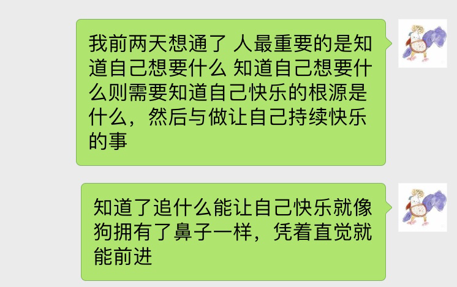
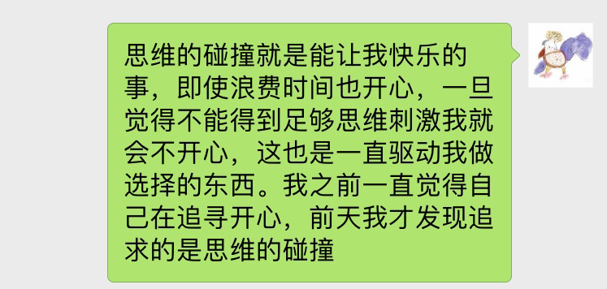

# 关于人生

三天前饭后，我坐在石头上突然开始思考人生，那天，我看到了自己可以怎样怎样**持续快乐的生活**，看到了自己**心底想要什么**。然后我迫不及待的与家人分享了自己所想，让他们知道我选择的路虽然看起来很辛苦，但是自己并不觉得，并且一直很开心。我开始告诉别人，**重要的是知道自己想要什么，知道自己想要，需要探索到使自己快乐的元是什么**。

以知道自己所要为基础，第二天，同样的时间，我开始思考伴侣 朋友，明确了适合我的伴侣朋友拥有的品性 特质，以及在现实中其会是什么样的人。进而保持持续、快乐、自发、向上的生活。

以下是后来聊天随性所写，隐含了很多懒得说的前提假设，大体表达了意思，但看起来并不严谨。

实际上20号那天我思考的第二个问题才是上述的自己想要什么。

第一个则是明确了**健康的重要性**。那天我对爸妈说，取得成就是需要时间的，对我来说，最重要的是你们的健康。你们长寿，我才有更多的时间去积累，你们也才能更多的享受到我带来的价值。对我自己来说，我的健康也非常重要，如果生命缩短了，获得的令自己满意的东西的价值也就缩水了。时间是最宝贵的资产。

我也跟他们说，无论什么年龄，**知道能让自己持续快乐的东西是十分重要的**。即使四五十岁，时间也还很长，你需要有自己的兴趣爱好。

我还告诉他们我**快乐的来源**，怎样会让我本能的不开心，我喜欢挑战、新的知识碰撞，不喜欢重复 解释。我觉得我们都可以持续学习 提高，当然，对父母是没有要求的，这只是个可能带来正向发展的提议。

这就是那天我明确的，健康，快乐之源，我与人交往的性情。

**知道了自己喜欢怎样的交往，不喜欢怎样的，以及什么令自己愉悦以后。第二天关于伴侣、朋友的思考也就顺理成章了。**

最近在看公司理财。今天饭后走路，突然想到将我上述关于找寻元快乐与公司理财联系起来。脑初始回路是这样的: 对于公司来说，首先要找到一个合理的目标，公司理财这本书将目标描述为，最大化股东权益，对于上市公司来说，因为股票反映了股东权益，所以目标是最大化当前股票价值。个人类比公司的话，我们的人生也可以确定一个目标，一个合理的目标就是最大化快乐值。经过思维模拟，我发现，通过这个搭线，可以将公司理财的很多理论运用到个人，并且能够通过逻辑以及简要公式解释：1 人为什么需要确定较为长远的目标； 2 我主题所说未说明的前提条件是什么； 3 为什么寻找到元快乐对于过上满意的生活是有效的 4 如何合理预期我们的行为决策
一个合理的比喻是将人生当做算法，生活可以看作寻找最优解的过程，这是个不断平衡的过程，除了可能存在的最优解还有很多令我们满意的解法。下面我将解释，元快乐并不是唯一的，为什么不断实现元快乐会是一个满意解，满意解是如何定义的，怎样又称得上元快乐。

先说下涉及到的金融学概念有 净现值 折现率 预期收益 风险 资本成本 股利 融资 代理成本，不过它们代表的意思在我后面的阐述中很容易推理出来。
